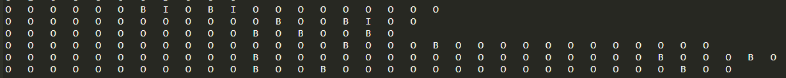

# DDI_extraction
Deep Learning-based Drug-Drug Interaction Extraction System

Biomedical knowledge is updated very fast, and it is very inefficient to rely on manual collation of a large amount of biomedical literature to get the drug interaction relationship.
In recent years, machine learning, deep learning and other artificial intelligence technologies have been widely applied to various fields of life, bringing great convenience to people's lives. This can greatly reduce the burden of medical professionals and medical database maintainers.

## Requirements

The main requirements are:

  - python==3.6.9
  - pytorch==1.7.0
  - transformers==3.2.0
  - tqdm

## ner_model
 
 
## ner output
 

## ner output process
 
 
## relation extraction model
 
 
## Usage

**1. Build Data**

Data pre-processing according to template data.

**2. Train**

There are two steps of named entity identification and relationship extraction, which are trained separately
